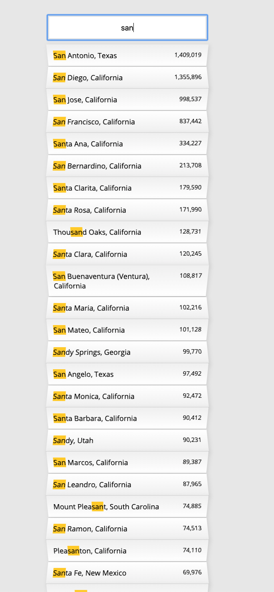

# 06. Ajax Type Ahead

#### _Ajax Type Ahead by JavaScript30 10/06/19_

## Description
This is Ajax Type Ahead application, 6th application out of 30 by 30 day Vanilla JavaScript Coding Challenge by Wes Bos.<br>
Please check the challenge from [JavaScript30](http://wesbos.com/javascript30/).




## About this Application
- When a user type, it'll show you the list of cities, states and the population, which matches with what the user typed.

- The city, state and population data is from the external source, `cities.json`.

- Use `fetch` for the API call.

- Use `regex` to find the matched result.


## Setup/Installation Requirements

1. Clone this repo:
```
$ git clone https://github.com/misakimichy/JS30-06-type-ahead.git
```

2. Navigate to the top level of the cloned directory.

3. Open `index.html` with your preferred web browser.

## Known Bugs
* No known bugs at this time.

## Support and contact details
 I welcome any feedbacks and comments: misaki.koonce@gmail.com

## Technologies Used
_Git, GitHub, HTML, CSS, Vanilla JavaScript

## License
Copyright © 2019 under the MIT License